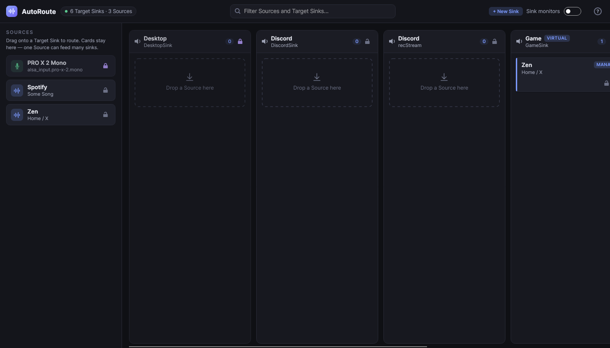
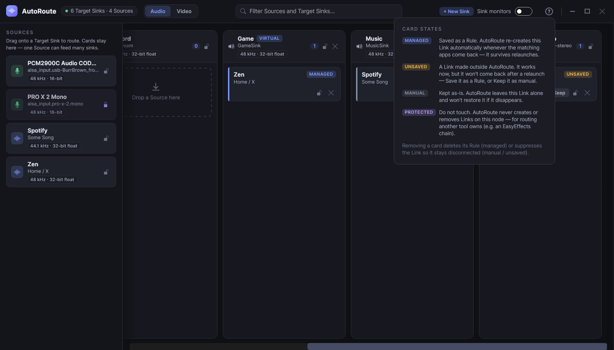

# AutoRoute

[](https://git.bussy.cloud/jessie/AutoRoute/actions?workflow=ci.yml)

**Wire your PipeWire audio once, and keep it wired.**

AutoRoute is a background service and GUI for Linux that remembers your PipeWire connections and re-applies them as apps come and go. It's a *persistent* [Helvum](https://gitlab.freedesktop.org/pipewire/helvum): you patch things the way you want, and AutoRoute keeps them that way — even though PipeWire hands out fresh node IDs every time an app restarts.



## The problem

By default WirePlumber routes every app to your default output. The moment you run separate virtual sinks — a `GameSink` feeding OBS, a `MusicSink`, a `DiscordSink` — you're back in Helvum re-patching by hand, because node IDs change on every launch and streams like Discord's per-call recording input reappear constantly. And those sinks themselves used to be a static config file you hand-edited and hoped survived the next PipeWire restart.

AutoRoute makes those patches stick, in **both directions**:

- A connection you make is **re-created** whenever the matching apps come back.
- A connection you remove **stays** removed — even when WirePlumber tries to re-add its default link.

## Features

- **Rules that survive relaunches** — connections are matched by application, not by throwaway node IDs.
- **Virtual sinks you own** — create and delete null sinks (`GameSink`, `MusicSink`, …) right from the board. AutoRoute keeps them alive across PipeWire restarts and recreates them at boot even when it isn't running, via a generated `pipewire-pulse` drop-in. No more hand-edited config files. Existing `virtual-sinks.conf` setups are detected and imported.
- **Fan-out** — send one source to several sinks at once (your headset *and* a capture sink for streaming).
- **Keep-connected and keep-disconnected** — positive rules hold a link open; suppressions keep it closed on every cycle.
- **Protected nodes** — mark routing that another tool owns (e.g. an EasyEffects chain) as off-limits, and AutoRoute won't touch it. Precedence is absolute: *protected > suppression > connect*.
- **A board, not a patchbay** — a clean dark UI with one column per sink and a palette of draggable sources; drag to connect, drop into several columns to fan out, filter by name. Channels are paired for you, and each card's state — *managed*, *unsaved*, *manual*, or *protected* — is spelled out at a glance.
- **Sample rate & bit depth at a glance** — every source and sink wears a small badge showing what it's running at (e.g. `48 kHz · 24-bit`, `44.1 kHz · 32-bit float`), read straight from the live graph.
- **Runs in the background** — a tray app (and an optional systemd service) reconcile the graph continuously; closing the window just hides it.
- **Non-destructive** — AutoRoute only ever removes links it created or ones you explicitly suppressed. Your other manual patches are never touched.

## Requirements

- Linux with **PipeWire** and **WirePlumber** (`pw-dump`, `pw-link`, `pw-mon` available on your `PATH`)
- The [**.NET 10 SDK**](https://dotnet.microsoft.com/download)

## Install

**AppImage** (no .NET required): grab `AutoRoute-*-x86_64.AppImage` from the latest
[release](https://git.bussy.cloud/jessie/AutoRoute/releases) (or the `AutoRoute-AppImage`
artifact on any CI run), `chmod +x` it, run it. Built by `scripts/build-appimage.sh`.
Once running, an AppImage keeps itself current: the ⬇ toolbar button checks the Gitea releases for
a newer version and installs it in place (download → checksum + boot self-test → atomic swap →
restart). `AutoRoute --check-update` is the headless equivalent.

**Arch (AUR)**: planned — a ready PKGBUILD lives in `packaging/aur/` and will be published
after the first tagged release.

**From source:**

```bash
git clone https://git.bussy.cloud/jessie/AutoRoute.git
cd AutoRoute
dotnet build
```

## Run

```bash
dotnet run --project src/AutoRoute.App              # open the window
dotnet run --project src/AutoRoute.App -- --background   # tray only, no window
```

Flags:

- `--background` — start hidden (tray only)
- `--poll` — poll `pw-dump` for changes instead of watching `pw-mon`

## Using it

1. Launch AutoRoute — the board mirrors your current audio graph. Links that already exist show up as **unsaved**.
2. Hit **+ New Sink** to spin up a virtual sink (name, description, stereo or mono). It appears as a column tagged **VIRTUAL** and is recreated on every boot; its delete button tears it down and cleans up any rules pointing at it.
3. Drag a source (an app stream, a microphone, or a sink's monitor) from the palette into a target sink's column to connect it. Drop it into more than one column to fan out.
4. Remove a card to disconnect. Removing an external link records a **suppression** so it stays gone.
5. Mark a node **protected** to tell AutoRoute to leave it and everything touching it alone.

Every card wears its state on its sleeve — **managed**, **unsaved**, **manual**, or **protected**. The circled **?** in the toolbar opens a legend explaining each:



Rules are written to `~/.config/autoroute/rules.json` the moment you make a change — there is no Save button.

## Autostart

**Easiest:** open the ⚙ menu in the toolbar and flip **Start AutoRoute when I log in**. AutoRoute
detects its own path (the AppImage included — no symlink, no hand-edited unit) and adds a desktop
autostart entry (`~/.config/autostart`). Your desktop launches it as part of your session, so it
inherits the display and tray environment a GUI app needs. Flip it off to remove it.

**By hand (headless / no desktop):** a systemd user service is also included, for setups without a
graphical session to autostart it. It launches `~/.local/bin/AutoRoute --background`,
so first make that name exist — publish the binary there **or**, if you use the AppImage, symlink it
(`ln -sf ~/Apps/AutoRoute-x86_64.AppImage ~/.local/bin/AutoRoute`). Full steps for both, plus an
XDG-autostart alternative, are in [`dist/README.md`](dist/README.md). Then:

```bash
systemctl --user enable --now autoroute.service
journalctl --user -u autoroute -f     # follow its logs
```

The unit lives at [`dist/systemd/autoroute.service`](dist/systemd/autoroute.service).

## How it works

AutoRoute reads the graph from `pw-dump`, matches it against your rules, and makes only the `pw-link` changes needed to reach the state you asked for — an idempotent reconcile that runs whenever the graph or your rules change. Each cycle first ensures your declared virtual sinks exist (loading them with `pactl` and writing a `pipewire-pulse` conf.d drop-in for boot persistence), then reconciles the links. Every link it creates is tagged `autoroute.managed`, so it can always tell its own links from yours and never cleans up a connection it didn't make. `pw-mon` tells it *when* to re-check; it never routes by name, only by numeric port ID.

```
src/AutoRoute.PipeWire/   # PipeWire interop: graph model + pw-dump/pw-link/pw-mon drivers
src/AutoRoute.Engine/     # rule matching, the reconciler, and rules.json persistence
src/AutoRoute.App/        # Avalonia MVVM board UI, tray, and the always-on host
tests/AutoRoute.Tests/    # xUnit test suite
```

Built with C# / .NET 10 and [Avalonia](https://avaloniaui.net/).

## Design notes

The reasoning behind the architecture is written down in the repo:

- [`PLAN.md`](PLAN.md) — the v1 build spec
- [`PLAN.v2.md`](PLAN.v2.md) — the v2 build spec (app-managed virtual sinks)
- [`CONTEXT.md`](CONTEXT.md) — the project's vocabulary
- [`docs/adr/`](docs/adr/) — architecture decision records

## License

[MIT](LICENSE)
